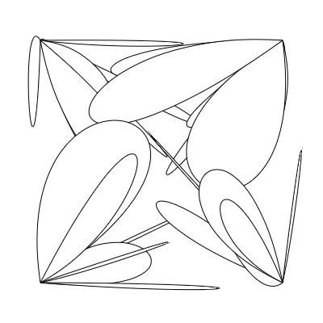
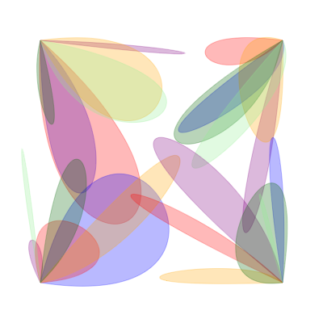

# Generative-Art

This repository contains my generative art scripts. They have been created with Processing for Python, R, pycairo and p5.js. Note that most of the scripts may not be efficient since these are my first attempts at learning Generative Art and I am still finding the right language for me (although p5.js seems best suited for the purpose so far). The idea for creating generative art was inspired by [Generative Art Speedrun](https://www.youtube.com/watch?v=4Se0_w0ISYk&t=1137s) by Tim Holman. 

## Resources

Some resources that helped me out:

* [Generative Artistry tutorials](https://generativeartistry.com/tutorials/) by Tim Holman 
* [ART FROM CODE](https://art-from-code.netlify.app/) by Danielle Navaro

### 1. Tiled Lines

Created using ProcessingPy. JavaScript tutorial by Tim Holman [here](https://generativeartistry.com/tutorials/tiled-lines/).

### 2. Cubic Disarray

Created using pycairo. JavaScript tutorial by Tim Holman [here](https://generativeartistry.com/tutorials/cubic-disarray/).

### 3. Spectral Disks

Created using ggplot2 in R. Inspired by Danielle Navaro's [tutorial](https://art-from-code.netlify.app/day-1/session-1/).

### 4. Protoplanetary Disks

Created using ggplot2 in R. Inspired by Danielle Navaro's [tutorial](https://art-from-code.netlify.app/day-1/session-1/).

### Wings

Created using p5.js

 

## License

This repo is licensed by the GNU General Public License v3.0. You can read more about it [here](https://github.com/drkndl/Generative-Art/blob/main/LICENSE).
