# Generative-Art

This repository contains my generative art scripts. They have been created with Processing for Python, R, pycairo and p5.js. Note that most of the scripts may not be efficient since these are my first attempts at learning Generative Art and I am still finding the right language for me (although p5.js seems best suited for the purpose so far). The idea for creating generative art was inspired by [Generative Art Speedrun](https://www.youtube.com/watch?v=4Se0_w0ISYk&t=1137s) by Tim Holman. 

## Resources

Some resources that helped me out:

* [Generative Artistry tutorials](https://generativeartistry.com/tutorials/) by Tim Holman 
  * I used this as inspiration for Tiled Lines, Cubic Disarray and Hypnotic Squares. The tutorials on the website are in JavaScript.
* [ART FROM CODE](https://art-from-code.netlify.app/) by Danielle Navaro
  * Tutorials here served as inspiration for Spectral Disks and Protoplanetary Disks.
* Structure de Quadrilateres is a shameless recreation of [Vera Molnar's](https://en.wikipedia.org/wiki/Vera_Moln%C3%A1r) masterpiece of the same name. The colour codes were borrowed from [cagrimmett's tutorial](https://cagrimmett.com/tutorial/2022/03/08/how-to-create-vera-molnars-structure-de-quadrilateres-in-p5-js/).
* Untitled Red Black (or Untitled 1970) is a recreation of [Georg Nees's](https://en.wikipedia.org/wiki/Georg_Nees) masterpiece of the same name. 
* Quadrate werden rot is a recreation of Frieder Nake's beauty of the same name.
* Rivers was inspired by and heavily relied on [hbyhadeel's tutorial](https://www.youtube.com/watch?v=6btSLYnf30M&list=LL&index=1) on masking in Processing.
* [Colour Lovers](colourlovers.com) and [Coolors](coolors.co) is a great source for colour palettes.

## Gallery

  
&nbsp; &nbsp; &nbsp; &nbsp;
  

  
&nbsp; &nbsp; &nbsp; &nbsp;
  

  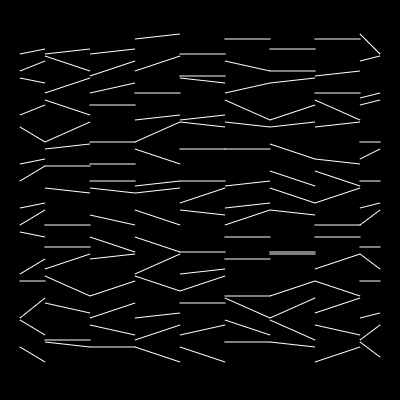
&nbsp; &nbsp; &nbsp; &nbsp;
  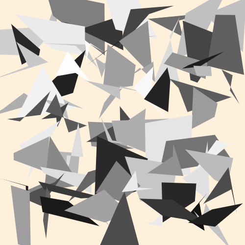

  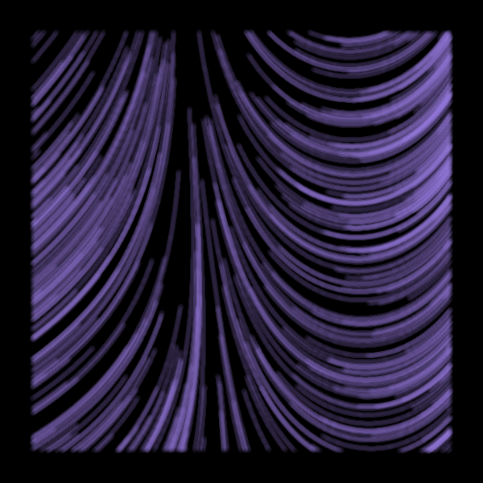
&nbsp; &nbsp; &nbsp; &nbsp;
  

  
&nbsp; &nbsp; &nbsp; &nbsp;
  

  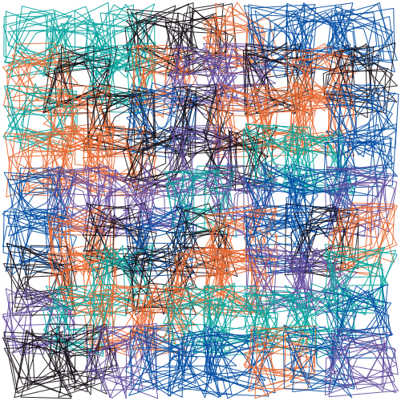
  &nbsp; &nbsp; &nbsp; &nbsp;
  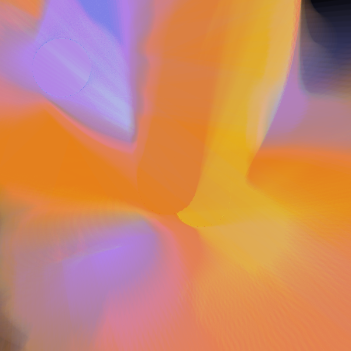

  
  &nbsp; &nbsp; &nbsp; &nbsp;
  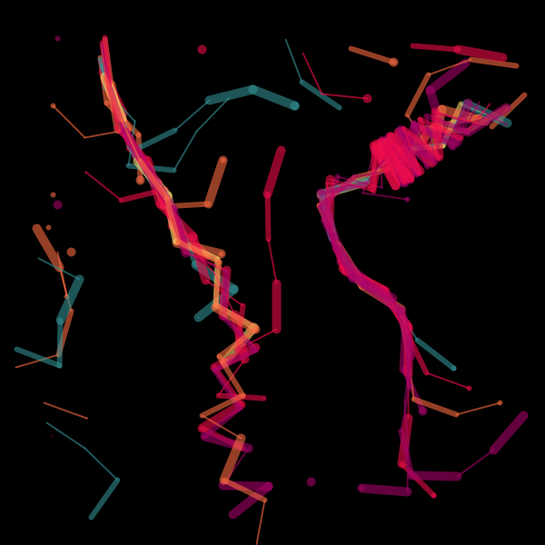
 

 
 

  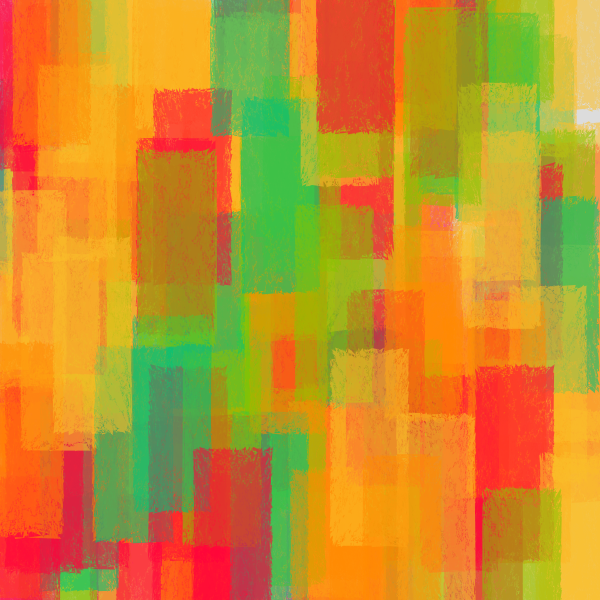
  &nbsp; &nbsp; &nbsp; &nbsp;
  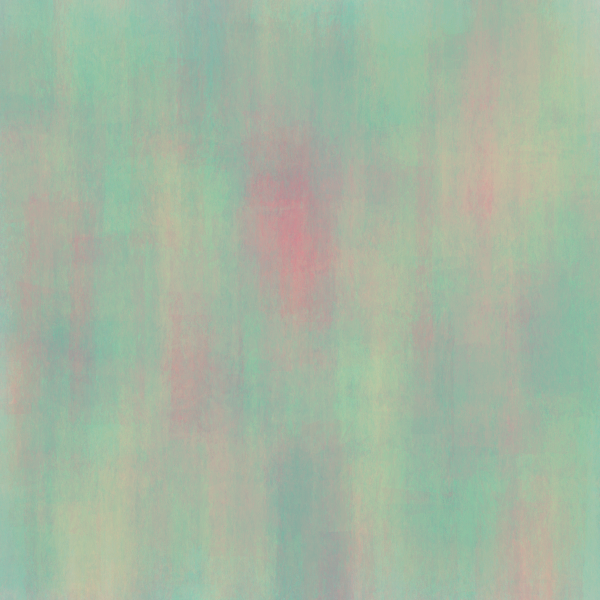
 

 
 

  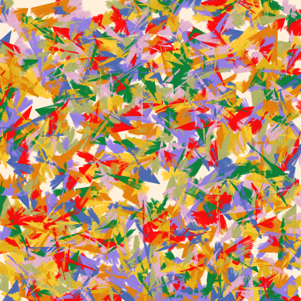
  &nbsp; &nbsp; &nbsp; &nbsp;
  
 

 
 

  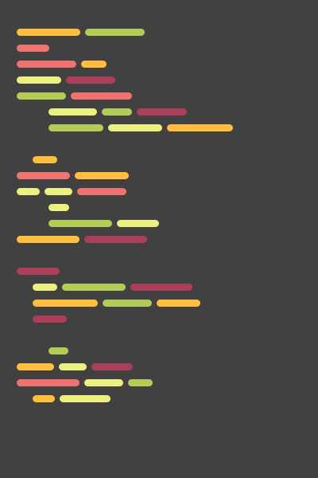
  &nbsp; &nbsp; &nbsp; &nbsp;
  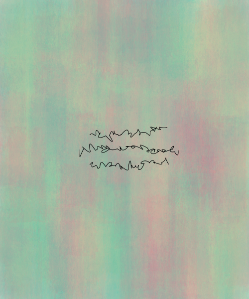
 

 
 

  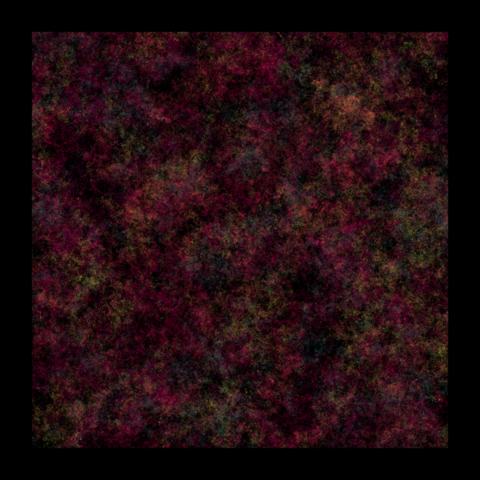
  &nbsp; &nbsp; &nbsp; &nbsp;
  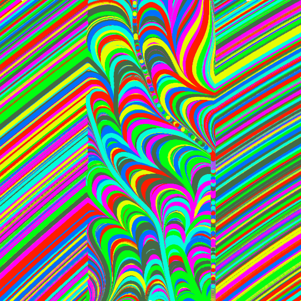
 

 
 

  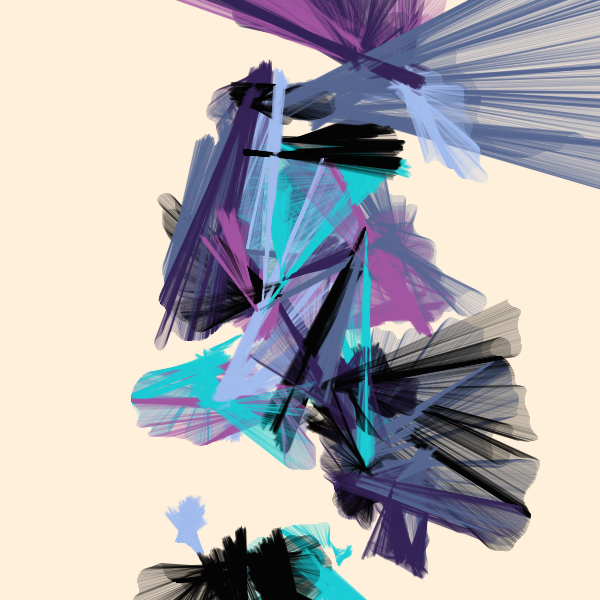
  &nbsp; &nbsp; &nbsp; &nbsp;
  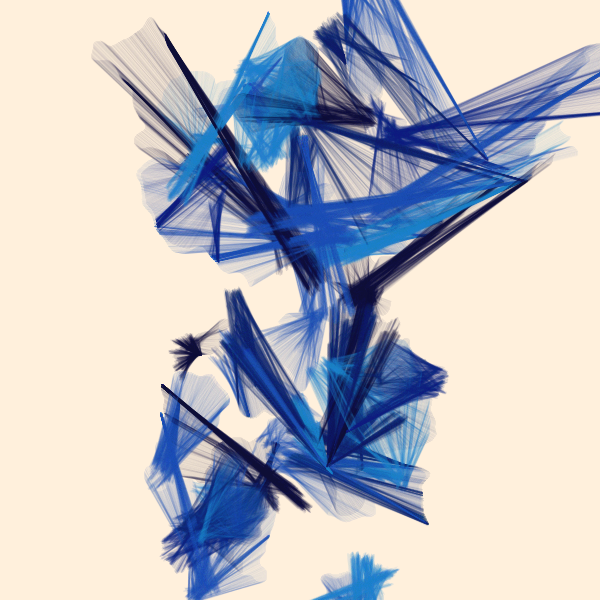
 

 
 

  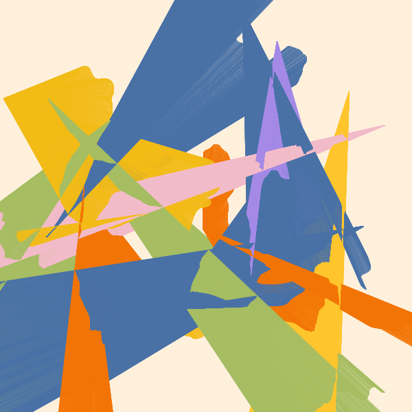
  &nbsp; &nbsp; &nbsp; &nbsp;
  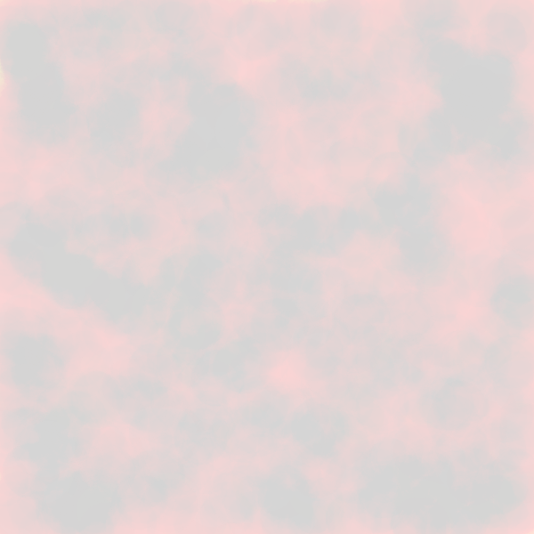
 

 
 

  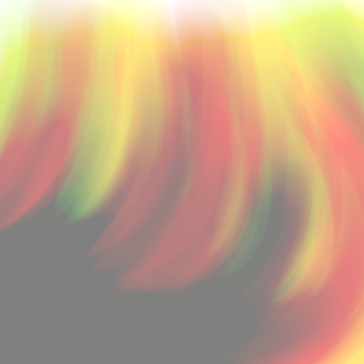
  &nbsp; &nbsp; &nbsp; &nbsp;
  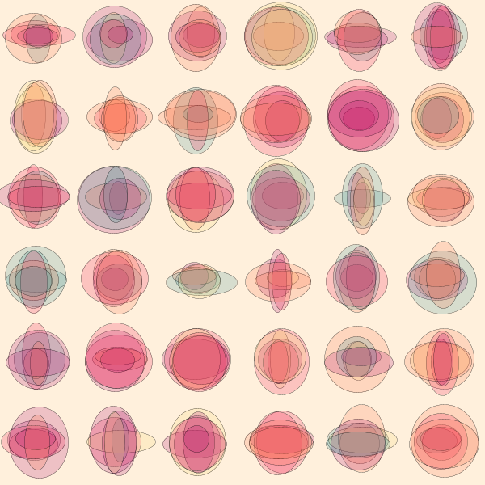
 

 
 

  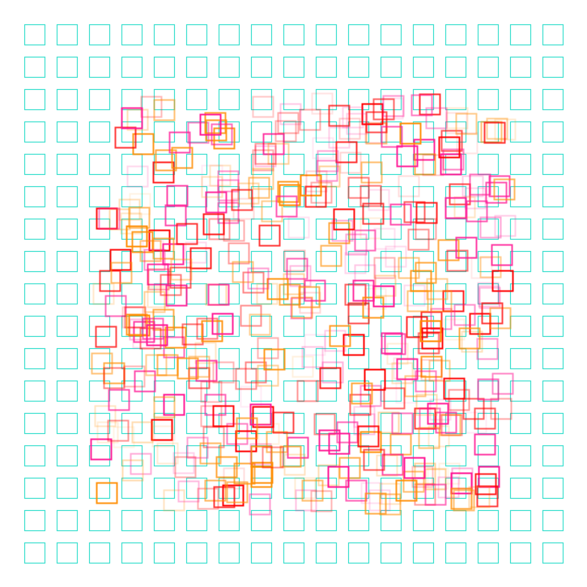
  &nbsp; &nbsp; &nbsp; &nbsp;
  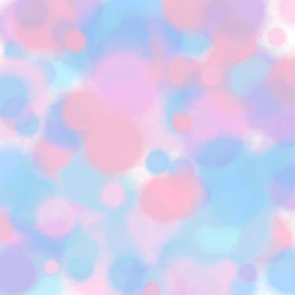
 

 
 

  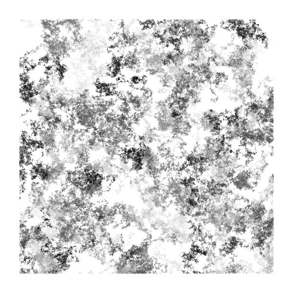
  &nbsp; &nbsp; &nbsp; &nbsp;
  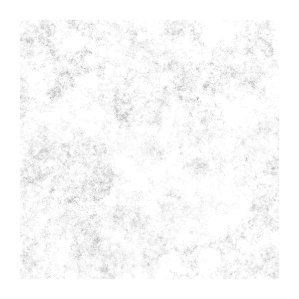
 

 

## License

This repo is licensed by the GNU General Public License v3.0. You can read more about it [here](https://github.com/drkndl/Generative-Art/blob/main/LICENSE).
